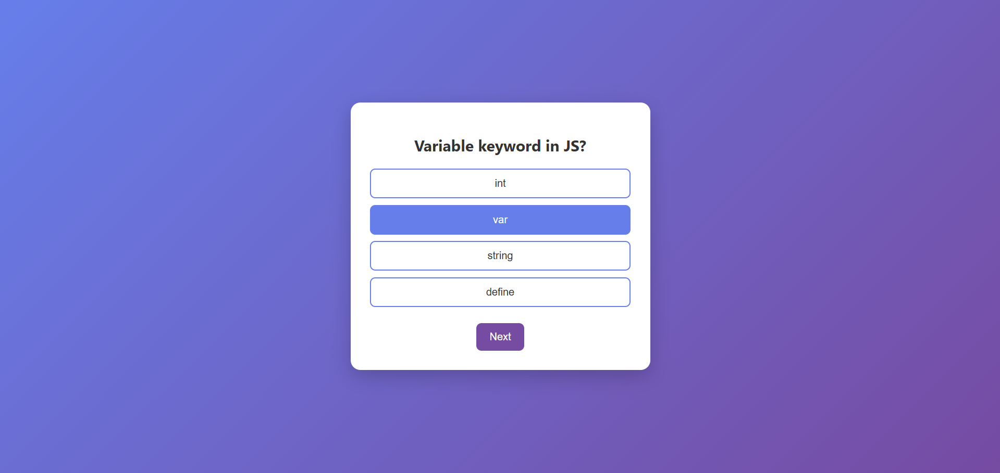
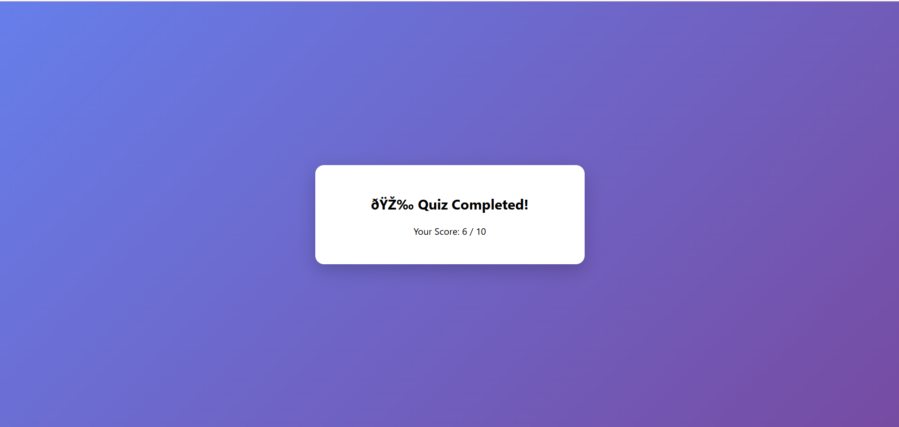

# 🎯 Online Quiz App

A simple and interactive **Online Quiz Application** built using **HTML, CSS, and JavaScript**.  
This project allows users to answer multiple-choice questions and view their final score.

---

## 🚀 Features

- ✅ Multiple-choice questions  
- 🎯 Option selection with highlight  
- ⚡ Next question navigation  
- 📊 Final score display  
- 🎨 Clean and responsive UI  
- ❌ Prevents skipping without selecting an answer  

---

## 🛠️ Technologies Used

- HTML  
- CSS  
- JavaScript  

---

## 📁 Project Structure

quiz-app/  
│── index.html  
│── style.css  
│── script.js  

---

## ▶️ How to Run

1. Download or clone the repository  
2. Open the project folder  
3. Double-click `index.html`  
4. The app will open in your browser  

---

## 🧠 How It Works

- Questions are stored in a JavaScript array  
- Each question is displayed dynamically  
- User selects an option  
- Score is calculated based on correct answers  
- Final result is shown after completing all questions  

---

## 📸 Screenshot

### Quiz Screen

### Result Screen

---

## 🌟 Future Improvements

- ⏱ Add timer for each question  
- 🎯 Show correct & wrong answers  
- 📊 Display percentage score  
- 💾 Save high scores  
- 🎨 Improve UI with animations  

---

## 📌 Note

This is a beginner-friendly frontend project created for learning and practice purposes.

